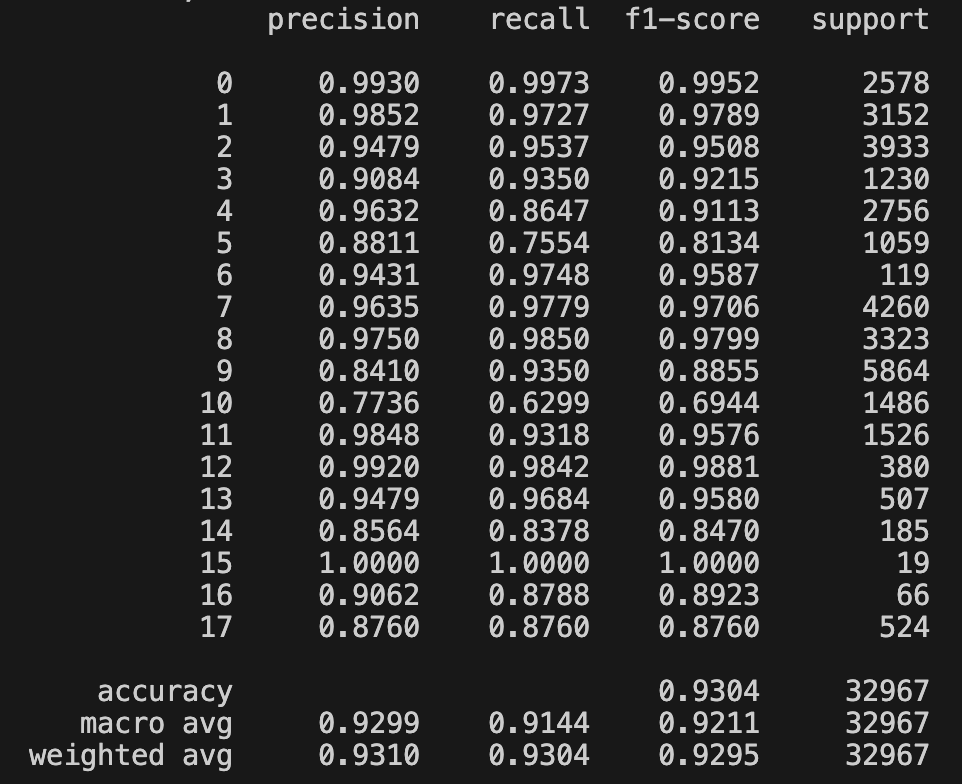

# 使用bert进行邮件地址分类
## 预训练模型下载
根据/bert_pretrain文件夹中的readme下载中文预训练模型

## 数据准备
使用/data地址数据进行模型训练，地址数据由文字-类别构成，样例如下
```text
浙 B-prov
江 I-prov
省 E-prov
慈 B-city
溪 I-city
市 E-city
掌 B-devzone
起 I-devzone
工 I-devzone
业 I-devzone
区 E-devzone
北 B-road
一 I-road
环 E-road
0 B-roadno
0 I-roadno
0 I-roadno
号 E-roadno
```

环境准备
```bash
cd /transformerself/Bert-Chinese-Email-Addresses-Classification
conda env create -n bert python=3.10
conda activate bert
pip install -r requirements.txt
```

## 训练测试
```bash
cd /transformerself/Bert-Chinese-Email-Addresses-Classification
python /train.py
```

## 分类指标
<div align="center">
  
  <p style="font-size: 10px; color: gray;">经典transformer</p>
</div>

