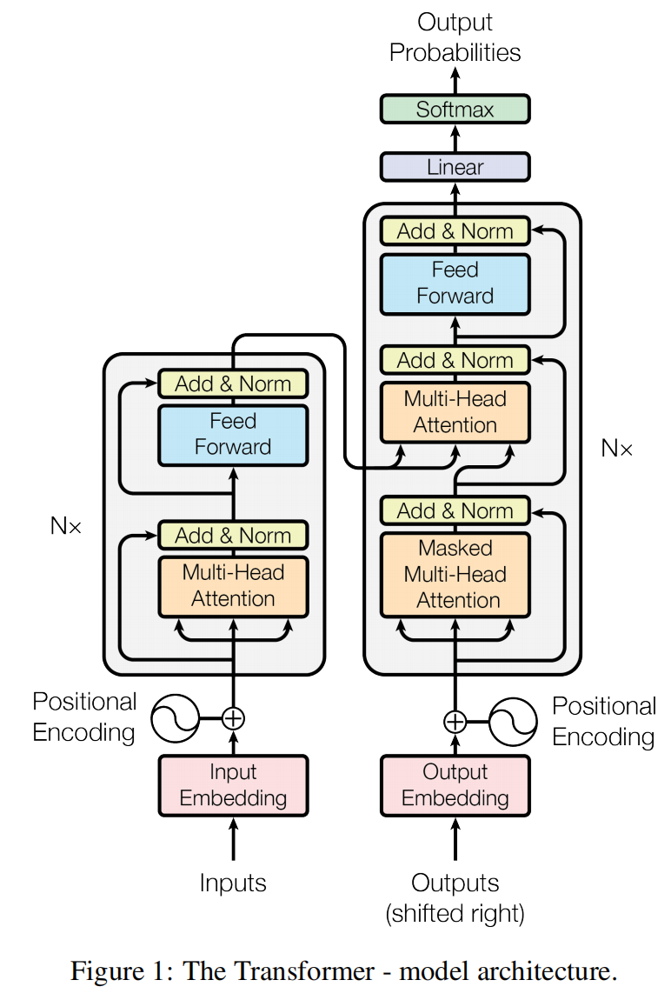
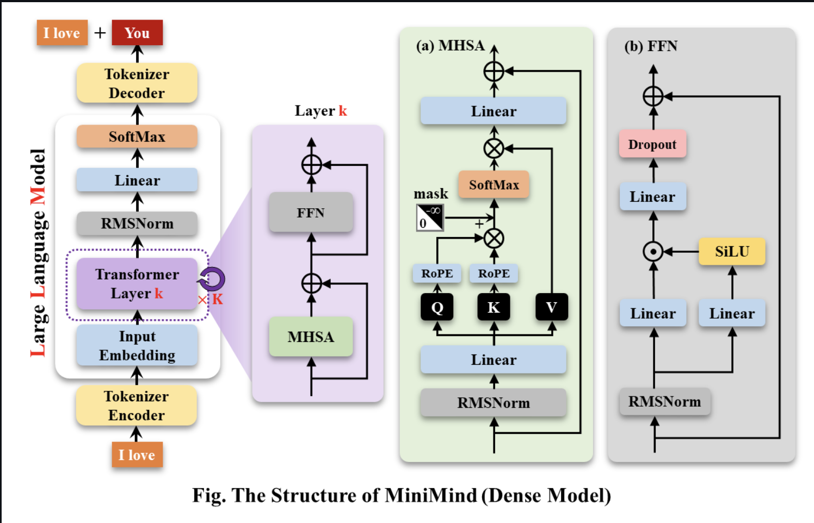
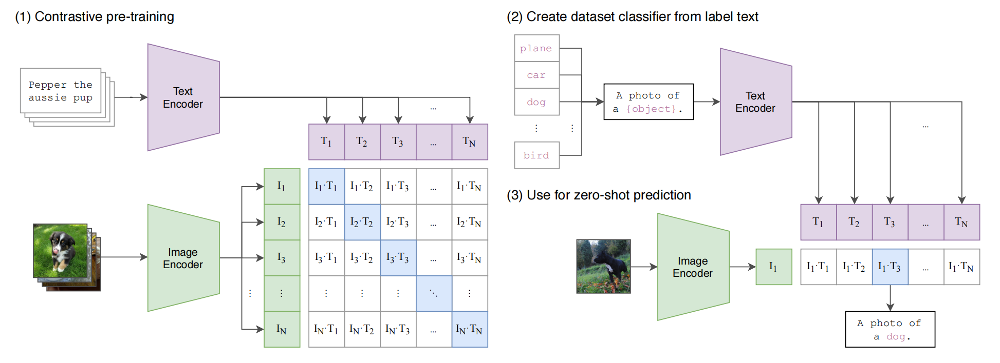
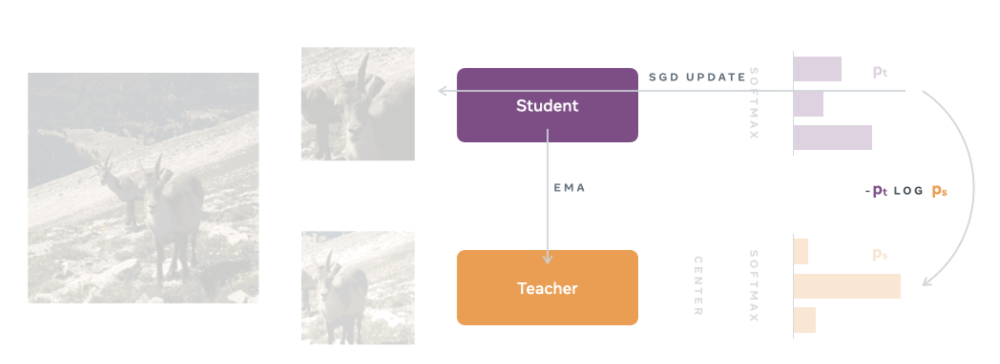
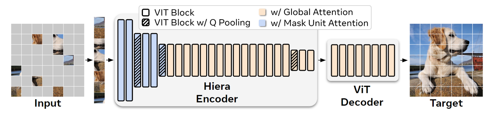
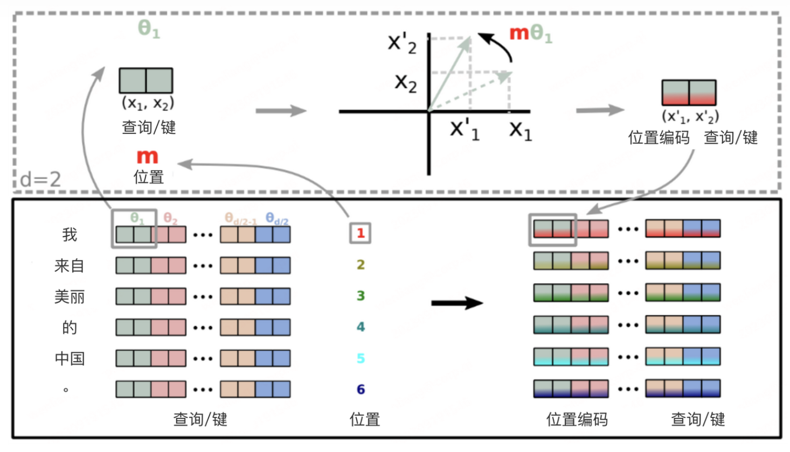

# 一. 介绍
&nbsp;&nbsp;&nbsp;&nbsp;&nbsp;&nbsp;
* 一个用于学习基于transformer的nlp和vit模型的菜鸟仓库，介绍模型原理，训练步骤，微调方法等
* 分享能快速理解并上手的代码实战项目（或推荐、或开发）
* 适用于具备一定torch基础、想要快速入门transform、想要能够阅读代码并二次开发的同学

## 目录
- [论文原理](#二-论文原理)
- [代码解读](#三-代码解读)
- [经典自然语言transformer](#四-经典自然语言transformer)
  - [GPT](##一GPT)
  - [Bert](##(二)Bert)
  - [T5](##(三)T5-encoder-decoder-集大成者-统一NLP任务)
  - [DeepseekV3](##(四)DeepseekV3-decoder-only-推理训练低成本怪物)
- [进阶-经典视觉transformer](#五-进阶-经典视觉transformer)
  - [Clip](##Clip-对比学习弱监督)
  - [LLaVa](##LLaVA-adapter高效多模态指令对齐)
  - [Dinov2](##Dinov2-区分性自监督蒸馏)
  - [Hiera](##HieraMAE自监督预训练)
- [模型压缩](#六-模型压缩)
- [附录](#附录)

# 二. 论文原理
首先推荐先阅读[周弈帆的博客解读transformer](https://zhouyifan.net/2022/11/12/20220925-Transformer/)， 达到能够理解以下重点

<div align="center">
  
  <p style="font-size: 10px; color: gray;">经典transformer</p>
</div>

* 注意力机制: `q*K^T`做一次向量化查询，`sofmax(q*K^T / sqrt(d_model)) * V`完成查询结果的加权, q*K^T权值大小与维度正相关, sqrt(d_model)用于softmax缩放，将梯度集中在明显变化区域。每一次查询匹配一次key表，生成新的val特征，特征优化方向与loss下降方向一致。可以理解为基于q进行特征挖掘，特征信息来源可以是自身相关或者其他主体。

* 多头注意力设计: 折叠分组查询，使用更少的参数量，进行更多特征空间的交互。

* 注意力mask: 在seq_length维度保证当前查询只能看到自己以及之前的信息，模拟rnn的串行输出，在decoder中的mask cross-attention出现。

* 可训参数矩阵`Wq Wk Wv Wo` 实现类似自动化特征工程的效果，如对一个查询向量q计算`q * Wk^T`可以得到新的查询，查询优化方向和loss下降方向一致，torch中以nn.Linear
线性层表示这些矩阵。  

* FFN前馈神经网络, 隐藏层维度设置`4*d_model`，特征向量映射在更高维的隐空间交互，实现类似特征增强的效果, 4这个值目前看没太多意义，应该是基于最佳实验原则设计。

* pos embeding沿着seq_length和d_model对应的两个维度对token embedding加上pos数值，标记位置信息。简单理解一个特征矩阵Q中任意一个数值通过向前diff和向上diff可以锁定位置坐标，模型可以学到这种模式。

* token embedding矩阵为可学习矩阵，实现将一个token_id转换为对应embedding向量，维度为d_model。

* 训练阶段，对比rnn, transformer能够做到训练的并行，即输出一次性包含了所有input片段的next token，得力于attention mask的设计, 模拟信息串行。

* 预测阶段，与rnn相同，transformer自回归预测下一个token，当出现终止符则停止。
  
**论文链接[attendion all you need](https://arxiv.org/abs/1706.03762)**，论文模型结构为encoder-decoder的结构，基于两个组件所衍生的经典模型见第四节。

# 三. 代码解读

&nbsp;&nbsp;&nbsp;&nbsp;&nbsp;&nbsp;
根据[周弈帆的博客-PyTorch Transformer 英中翻译超详细教程](https://zhouyifan.net/2023/06/11/20221106-transformer-pytorch/)手撕一遍transformer的代码，了解各个组件设计以及代码设计风格。该代码基本与transformer论文结构相同，唯一的区别在于最后的`ouput_head`是一个单独的线性层，与embeding层不共享权重。

# 四. 经典自然语言transformer

## GPT
* 介绍: decoder-only结构，通过mask self-attention保证每个token只能看到上文信息，输出自回归预测下一个token。适用与输出为下一个关联token的所有sep2sep任务，如：问答，机器翻译，摘要生成，音乐生成等。

* 预训练: 采用自回归语言模型训练方式，训练目标为预测下一个token，即输入是一段文本，输出是下一个文字。

* 微调: 采用sft监督指令微调，对每一条input-out数据对处理为特殊问答模版input进行自回归训练

* 偏好对齐：采用RLHF的PPO或DPO对齐模型输出偏好 

### 实战重点介绍llm模型训练流程及方法 - 以完整训练一个GPT的问答模型为例

&nbsp;&nbsp;&nbsp;&nbsp;&nbsp;&nbsp;
推荐根据轻量化llm项目完整走一遍对话模型的开发[Minimind](https://github.com/jingyaogong/minimind)。
&nbsp;&nbsp;&nbsp;&nbsp;&nbsp;&nbsp;
> 只要求跑通进行代码阅读的情况下，4Gb显存的卡将batch_size设置为1可以吃得消。

<div align="center">
  
  <p style="font-size: 10px; color: gray;">minimind项目decoder-only结构</p>
</div>

---

#### 1. Pretrained 预训练
* prtrained的目的是让模型具备合理预测下一个token的能力，合理体现在能够根据一个字输出符合逻辑的话一段话，简而言之就是下一个字接龙。

* prtrained的输入是`input_ids[:-1]`， 标签是`input_ids[1:]`，input_ids是指文字经过tokenize后的id列表，如`我爱你 -转换-> <s>我爱你<\s> -映射-> [1, 2, 23, 4, 2]`
  * 之所以输入与标签要错一位，目的在于实现预测下一个token的监督学习，例如输入文字是”我爱你啊“， 那么预测下一个token逻辑是`我 --预测--> 爱; 我爱 --> 你；我爱你 --> 啊`
  * 使用mask能对信息进遮掩，确保每个位置只能看到上文信息，实现训练并行，即模型ouput中的每一个位置是由该位置之前的所有信息预测得到的, 初始的`ouput[0]`则由`<s>`预测得到。
  * 这里的训练并行可以与RNN的训练串行进行对比，RNN训练则需要依次次输入`x我y爱，x我爱y你，x我爱你y啊`，只是中间有一个隐态传递过程

* prtrained的损失函数为corss_entropy，模型输出的logits维度为`(batch_size, max_seq_length, voc_size)`, `max_seq_length`为对文本截长补短的最大长度，`voc_size`为词表的token数量。损失计算的逻辑为对logits沿最后的轴进行softmax得到几率，形状不变；沿着max_seq_length取出label对应的token_id计算corss_entropy；由于所有label的真实长度不一定为max_seq_length，对短的label需要补全一个padding占位，才能进行mini-batch训练，因此需要设置一个真实token_id的mask标记真实需要进行损失计算的label元素。

---

#### 2. SFT 监督微调
* sft监督微调的目的是让模型具备对话能力，通过将prompt嵌入问答模版，如`用户<s>说:你是谁？</s>\n助手<s>回答:我是人工智能助手</s>\n`，构成一个新的语料微调预训练模型，继续训练模型对这类模版的下一个字接龙能力。
  
* 对话模板通过引入特殊的字符，微调后能够让模型理解问题句柄，知道这是一个问题，从而触发预测问题后面的答案。

* sft与prtrained区别在于损失的计算以及训练的参数。
  * sft只计算output中对应标签`回答: ***`的部分，其余部分不计入损失，但这些部分会在attention中被关注到
  * 训练参数取决于不同的微调方法，常见 full-sft, lora, bitfit, preEmbed, prefix, adapter等

##### 01 full-sft 全量微调
全量微调是指使用pretrained初始化权重，使用较小的学习率对模型的全部参数进行训练，语料设计和损失设计同上。
  
##### 02 lora-sft 低秩矩阵自适应微调
  [lora](https://arxiv.org/abs/2106.09685)对可学习矩阵**W（Wq Wk Wv Wo ...）**，增加两个低秩矩阵A和B，对输入进行矩阵乘法并相加`XW + XAB = X(W + AB) = XW‘`，`W'`为更新后的参数矩阵。假设原参数矩阵W的维度为`(d_k, d_model)`, 低秩矩阵A、B维度应该满足```(dk, r) (r, d_model)```，r为秩参数，r越大则A、B参数越多，W可更新的`△W`分布自由度更大。  
  
  相比全量微调lora需要的显存大大减小，但在小模型上训练速度不一定更快
  > 小模型forward过程耗时占比增加
  
##### 03 其他微调方法
* PreEmbed，只微调token embedding参数矩阵，适应新的数据分布
  
* Prompt tuning，在输入token前增加特殊的提示token，只微调提示token的embeding向量参数，适合小模型适配下游任务

* P tunning，是Prompt tuning的进阶版，提示token可插入prompt的指定位置

* Prefix，在attention中的`K=X * Wk，V=X * Wv`对X增加可学习前缀token embeding矩阵，作为虚拟的提示上下文, `K=[P; X]Wk V=[P; X]Wv`P是可学习的参数矩阵，维度(L, d_model)，L表示需要增加的提示前缀长度，是超参数。`[P; X]`表示在X输入矩阵开始位置拼接矩阵P。
  > prefix微调的是每一个transform层中的attention可学习前缀矩阵P，不同的层中，P不共享。    
  
* Bitfit，只微模型的偏置项，偏置项出现在所有线性层和Layernorma层中。    

* Adapter，在transform模块的多头注意力与输出层之后增加一个adpter层，只微调adpter参数。 adpter包含`下投影linear + nolinear + 上投影linear; skip-connect结构`， 中间结构类似lora变体为`nonlinear(XA)B`的结构，skip-connect结构保证的模型能力最多退化为原模型；由于改变了Laynorm输入的数据分布，Laynorm的scale参数也需要加入训练。  

---

#### 3. preference opimized
  偏好对齐(优化)的目的是让模型的输出更加符合用户的习惯，包括文字逻辑、风格、伦理性、安全性等。  

##### 01 ppo
  * 具体的解读和代码注释，参照我的另一个仓库[deepseek_learning: r1 ppo](https://github.com/Aorunfa/deepseek_learning)

##### 02 dpo
直接偏好优化(direct-preference-opimized)与ppo不同，直接跳过了奖励模型的训练，根据偏好数据一步到位训练得到对齐模型。[论文](https://arxiv.org/abs/2305.18290)解读可以参考博客[人人都能看懂的DPO数学原理](https://mp.weixin.qq.com/s/aG-5xTwSzvHXN4B73mfKMA)  

dpo从ppo总体优化目标的三个原则出发```模型输出尽可能接近偏好标签，尽可能偏离非偏好标签，尽可能少偏离原模型输出```，推导最优奖励模型的显式解，代入奖励模型的损失函数，得到一个只与待训模型有关的损失函数，该函数就是偏好优化的目标。 

筒体而言就是理论推到了一个损失函数，用这个损失函数微调模型

> 手撕dpo训练代码可以参考本仓库的`/minimind/5-dpo_train_self.py`，前提要先自己捋一遍minimind

#### 4. evalization
... pending 不同的任务评价指标不同，需要系统梳理多任务类型才能进阶

----
  
## (二)Bert
* 介绍: encoder-only结构，只包含transform encoder部分。self-attendtion保证每个tokend都可以看到上文和下信息，输出与句子整体语义相关，无法自回归预测next token。适用于输出为类别、数值的所有sep2sep，sep2val任务，如: 分类问题(情感分类，邮件分类, 多选问答，抽取问答...)，序列标注（词性标注 邮寄地址信息提取）, 语义相似度... 对于bert的解读可以参考[链接](https://github.com/datawhalechina/learn-nlp-with-transformers)

* 预训练: 采用mask language和相邻句子判断的方式进行预训练。  
  > * mask language随机遮掩token(15%, 其中10%被随机替换为其他token, 5%为统一替换为mask token)，输出预测被遮掩的token，通过这种挖词填空促使模型也能理解上下文信息；
   
  > * 相邻句子判断，需要将输入划分为句子+分隔标记+下一句子，通过CLS位置的输出进行分类监督, 使模型能够理解上下句的关联。这个训练步骤在后续的研究中逐渐淡化。  
  
  > * 特殊输入标记包括，类别标记`[CLS]`，句子分隔标记`[SEP]`，遮掩token标记`[MASK]`。`[CLS]`标记标记主要用于提取句子的整体语义，后续作文下游分类头的输入，也可用于语义相似度。  
  
  > * embedding由三类向量相加：`embeddings = words_embeddings + position_embeddings + token_type_embeddings`，token_type区分上句或下句，三者都是可学习参数，形状分别为`(voc_size, d_model), (max_len, d_model), (2, d_model)`。相加的含义可以用one-hot编码就行解释，等同于`onehot[word-hot, pos-hot, type-hot] * [W_word, W_pos, W_type]`。

  > * 位置编码由上面的position_embeddings完成，为可学习参数
  
  > * padding mask区分实际token和padding token，用于在softmax中归零padding token的权值，例如一个token查到paddingtoken，计算得到的注意力权重应该为总是0。

* 微调: 以bert作为backbone增加输出头，初始化pretained权重，只训输出网络或较以较小学习率全量微调即可达到不错的效果。

* 实战bert中文地址分类:见本仓库`/Bert-Chinese-Email-Addresses-Classification`，适用地址文本解析，快速理解整个bert模型结构，微调数据的加载方式和训练过程。参考于项目[bert中文分类](https://github.com/649453932/Bert-Chinese-Text-Classification-Pytorch)
  
## (三)T5 encoder-decoder 集大成者，统一NLP任务
* 介绍: encoder-decoder结构，使用完整的transform结构，统一的text-to-text框架，适用于所有的NLP任务包括文本分类、机器翻译、摘要生成、问答等。[论文地址](https://arxiv.org/abs/1910.10683)[论文解读](https://zhuanlan.zhihu.com/p/89719631)
  
  一些结构差异说明：
  
  > * 共享的相对位置编码：在attention的`qi * kj^T`计算得到的logits加上一个可学习的偏置项`bij`，在每个注意力层的同一个头共享一套bij参数。[详解](https://blog.csdn.net/qq_44665283/article/details/140526203)
  > * Teacher Forcing的训练策略。本身用于rnn自回归任务中，训练时使用t时刻的真值作为t+1时刻的输入，但需要计算t时刻预测与真值的损失。大白话就是将input[:-1]作为输入，input[1:]作为标签，t5的预训练使用这种，**而不是bert输出与输入的位置对应**。

* 预训练：训练方法选择 mask-and-mask-ratio、prefix的text2text方法
  > * prefix的text2text框架，将所有的任务通过prefix进行表示，标签统一转换为prefix+文本到prefix+文本的形式，见微调的例子
  > * 预训练方式：采用bert风格掩码语言模型的训练方式，预测mask的部分。实验对照：自回归式、文本打乱还原式
  > * 破坏方式：采用replace span，replace连续的token并打上唯一标记，target为`(唯一标记 + mask内容) * n + 终止符号`，可加速训练。对照：bert的mask方式，随机丢弃
  > * 破坏比例：采用15%的破坏比例。
  > * 遮掩span长度：采用3的span长度。
  > * 多任务加微调策略：**无监督数据里面混入一定比例的多任务的有监督数据**，有监督数据的构造方式同finetune中text2text输入输出格式。与加入多任务数据数据预训练差不多，但最后采用的原因是可以监督下游多任务的性能。
  
* 微调：全量，逐步解冻，adapter
  > * text2text输入输出格式: 输入为`任务类型prefix + input; 目标prefix + target`，如翻译任务将输入`{'en': 'That is good', 'ge': 'Das ist gut'}`转换为`{'input': 'translate English to German: That is good', 'target': 'Das ist gut'}`最终合并为prefix标注输入`translate English to German: That is good. target: Das ist gut`。对于其他任务的转换形式见论文附录D。
  > * 还是全量微调更胜一筹，逐步解冻次之

* 实战：中文文本摘要总结实战，见目录`/T5-pegasus-chinese`，训练loss和case大致符合预期
  > * greedy-decoding vs beam-search：两者适用于自回归场景。
  > * greedy-decoding，每次选择概率最大的token作为下一个输入。
  > * beam-search，设定beam size为k, 第一次回归选择top k的输出token作为k个波束序列, 下一次依次对k个波束进行自回归，得到k*k个波束，按照token的累乘或平均logit保留top k的波束序列，依次往后执行k个波束的自回归和排序过滤操作。保证模型每次回归只执行k次推理。一般用于翻译和摘要输出。

## (四)DeepseekV3 decoder-only 推理训练低成本怪物
* 具体的技术点解读和代码注释，参照我的另一个仓库[deepseek_learning](https://github.com/Aorunfa/deepseek_learning)

---

# 五. 进阶-经典视觉transformer
这一章介绍tranformer在视觉领域的经典应用，能够快速上手新的视觉项目。

## Clip 对比学习弱监督
[clip](https://github.com/openai/CLIP)作为多模态的早期经典之作，主要通过对齐文本编码和图片编码，让模型能够匹配图片和给定文本，或匹配文本和给定的图片。主要适用视觉表征、文本到图片或图片到文本的匹配场景。特别地，clip预训练使用的大多是图片类别文本，我理解更适用以物体文本搜图。

<div align="center">
  
  <p style="font-size: 10px; color: gray;">clip思路(搬运自CLIP)</p>
</div>

#### 预训练总体思路：
  * 文本编码器使用类似带casual-mask的transformer结构，对文本最后添加一个结束符`=`，使用因果mask的注意力机制，经过transform后取结束符对应的编码表征文本信息
  * 图片编码器使用经典vit(和resnet)，通过卷积划分不重叠的patch，展平，在开头添加一个cls token对应的embedding, 再喂入带self-attention的transform，提取cls对应的嵌入向量表征图片信息
  * 损失计算，对batch内的图片向量组和文本向量组，进行两两组合计算相似度，最大化数据集中对应的图片-文本的相似度

clip实现vit，以224×224特征、32×32patch size为例:
  > * 以32×32kernal大小，32stride，输出channel为3，输出channel为d_model的卷积核完成patch划分和特征提取，得到形状为(7,7, d_model)特征图，展平为(49, d_model)的token_embeding矩阵
  > * 在的token_embeding矩阵的首行嵌入一行CLS向量，用于表征整个图片的特征，向量参数为可学习参数，token_embeding最后形状为(50, d_model)
  > * position embeding采用可学习参数
  > * 经过transform后提取CLS向量对应的特征向量，通过一个前馈网络将特征维度对齐的到文字的特征维度`nn.Linear(oupt_dim, d_model), d_model for text`表示图片的分类特征

#### 一些后续泛化工作
  * [Blip](https://github.com/salesforce/BLIP)，增加图片caption、qa能力
  * [LLaVA](https://github.com/haotian-liu/LLaVA)，clip visual enoder + llm，高效对齐多模态指令遵循
  * [DALL-E](https://github.com/openai/DALL-E)，增加基于VAE的文本到图片的生成
  * ...

#### 实战
CLIP的代码比较好读懂，从CLIP的代码可以快速搞懂Vit的具体的实现过程。  
Clip官方repo没有开源训练代码，不太好理解算法实现的具体细节，为此我结合[open_clip](https://github.com/mlfoundations/open_clip)，写了一版clip训练代码，可以参照[clip_finetune](https://github.com/Aorunfa/clip_finetune)，只需要少量数据和资源进行快速复现，方便快速理解算法设计细节

---

## LLaVA adapter高效多模态指令对齐
llava更新了三个版本v1、v1.5、v1.6。整体结构为使用vit作为vison-encoder，权重初始化自clip，使用预训练的llama作为text decoder，中间设置一个adapter，将vison token对齐到text token的embedding向量空间。    
在vison token featuer 前后增加特殊的图片开始和结束标志位，和text token完成特征拼接。   
llava的优势在于，使用的训练数据极少，完整的训练时间非常短，8A100一天完成训练。   

> **llava-v1**的adapter设置为一个简单的投影矩阵（单linear层）完成对齐，输入图像分辨率为224。

> **llava-1.5**的adaptr设置为一个两层的MLP层完成对齐，vison encoder使用更大的clip vit模型，输入图像分辨率为336，同时prompt中设定短答案输出的格式，提高短输出benchmark的准确度

> **llava-1.6**从源码看来，是对论文中llava-1.5=HD的实现。使用224分辨力的clip作为vision encoder。对高分辨率的图片resize并padding到预设高分辨率，将图片等分为四个区域加上一张原始resize图片(224的分辨率)，分布进行encoder后完成拼接，得到token featuer

### 训练
训练包括两个阶段，全程冻结vison encoder，第一阶段只训练adapter，完成模态对齐。第二阶段训练adaper和llm，完成指令微调。  

### 实战
llava是学习如何使用transformer库进行大模型训练的好的范式，可以从这个项目中提取以下训练方法
- lora微调
- qlora微调
- 4bit、8bit量化训练
- fsdp分布式数据并行训练
- deepseed的zero范式和accelerate加速

我从llava将上述方法单独列出，进行了微小的改动，特别针对fsdp写了一版训练代码，方便快速理解训练实现细节，实战项目[lava_fitune](https://github.com/Aorunfa/llava_finetune)

---

## Dinov2 区分性自监督蒸馏
[dinov2](https://github.com/facebookresearch/dinov2)是视觉自监督训练的经典之作。总体思路使用局部的特征信息对齐整体的特征信息，使模型能区分图片的物体空间分布信息；整体特征由教师模型提取，局部特征由学生模型提取，教师模型权重由学生模型通过ema更行。主要适用视觉表征适应下游分类、分割等任务和以图搜图等，对比clip是一种自监督方法，预训练不依赖标签信息。

<div align="center">
  
  <p style="font-size: 10px; color: gray;">dino思路(搬运自DINO)</p>
</div>

#### vit结构
* patch embeding: 卷积实现投影矩阵
* pos embedding: 使用可学习参数相加，分为cls embedding和patch embedding，插值实现patch的延展
* transformer block: 使用残差块的droppath方法
* head: MLP, 解耦image-level和patch-level的权重；用于平衡dino和ibot的损失

#### 蒸馏学习
* 教师模型与学生模型使用同一个模型结构。不同在于，教师模型输入2张global crop，学生模型输入8张local crop
* 将教师模型与学生模型的输出特征进行对齐，促使学生模型能够通过局部了解整体的能力
* 教师模型的参数通过ema加权学生模型的参数与历史参数，提高训练稳定性

### 损失设计
* do_dino: image level，教师与学生模型的cls输出经可能相似，教师global输出对齐对应的学生global、学生所有的local输出
* do_ibot: patch leval, 对于gloable，学生模型随机mask一些patch，教师模型正常输入。对mask的学生模型patch使用可学习的参数替换embeding，mask patch的最后输出与教师模型的gt尽可能相似
* do_koleo, 促使批次在特征空间内更加均匀分布，只监督学生模型vit的cls输出。蒸馏需要将输出升到超高维，如果存维度的数值集中在某些维度区域，很有可能造成模型参数更新的“偏心”，侧重对齐某些部分参数而失去的整体性的考量

* SwAV：样本中心化方法， Sinkhorn-Knopp归一化。对教师模型的输出进行batch的去中心化


### 实战
...pending
02 手撕一版友好阅读的训练代码, dino简单预训练代码
    dinov2 原始的仓库项目深度使用的fsdp训练的组件，实现模型分片、进程同步、分片模型保存的
    
01 使用dino进行图片的retrival，以图搜图 -- 手撕一个retrival代码

### 一些后续泛化工作
  * [grounding-dinov](https://github.com/IDEA-Research/GroundingDINO)

---


## Hiera MAE自监督预训练
> 引子：之所以把hiera加进来，是由于其用到了MAE的高效自监督训练方法理解图片结构信息，同时sam2也以hiera作为高效特征提取器

[hiera](https://github.com/facebookresearch/hiera)第一个特点是优化了传统vit结构在特征分辨率始终如一的特性，使用了池化的方式减小深层的特征的分辨率，提高了参数利用率(可以类比于经典高效卷积结构大多是多层级的分辨率特征图进行组合)，第二是采用了[mask-auto-encoder](https://github.com/facebookresearch/mae)的自监督方法进行预训练  
hiera更轻量，微调下游任务效果更好，官方主要针对imgnet1k分类和k-400视频动作的分类进行了微调。论文解读可以参照[Hiera笔记](https://zhuanlan.zhihu.com/p/719060883)

<div align="center">
  
  <p style="font-size: 10px; color: gray;">hiera思路(搬运自Hiera)</p>
</div>

#### hiera 特征提取器
  * 结构设计总体思路
    > * 浅层layer使用高分辨率和小特征维度，深层特征使用低分辨率和大特征维度
    > * 使用maxpool进行特征图下采样
    > * 前两阶段使用局部注意力机制（mask unit window），后两个阶段使用全局注意力机制
  
#### MAE 训练方式
该方法主要是随机遮掩图片的patch窗口，将未遮掩的patch窗口拼接，送入encoder进行编码，再由decoder预测出被mask掉的patch窗口，mask的patch窗口的真值和预测值最后会由一个nn.Linear层将特征维度映射到超高维度，使用MSE损失度量分布差异
* mask生成: 计算遮掩给定大小连续patch的方阵(mask_unit)后得到的特征图分辨率，基于该分辨率随机mask给定比例的点，保证batch内的每一个图mask的比例相同，才能进行min-batch training
* 损失计算
  * encoder得到没有被mask掉的patch特征
  * 恢复到原来的patch排列顺序，mask区域填充可学习参数，非mask区域填充encoder得到的特征
  * 送入vit decoder得到最后的pred
  * 标签产生，对原始图片按照最终的下采样stride分块，块状内的channel展平，对齐pred的特征空间维度。筛选出被mask掉的区域
  * 通过线性层间预测值与真值的特征维度映射到超高维度(65535), 使用均方误差计算pred和label的差异

#### 实战
Hiera的代码在maxpool的操作上极难读懂，但实战只需要知道函数功能即可
Hiera官方repo没有开源训练代码，为此写了一版mae和微调的训练代码，可以参照[hiera_finetune](https://github.com/Aorunfa/hiera_finetune)，同样只需要少量数据和资源进行快速复现

---

# 六. 模型压缩
... ongoing

## 蒸馏
适用将大模型的知识转移到小模型

蒸馏原理:
本质上是对教师模型的输出logits进行升维度，e.g 65535。训练过程中对学生模型输出logits升维，对齐学生模型与教师模型输出。升维矩阵可以是随机初始化的。
对齐损失可以使用corss-entropy，KLloss；同时对logits的分布形态也可以做一些监督，避免偏态等。
> 实战见dinov2_finetune 

## 量化
适用大模型训练、推理降低显存，牺牲时间换空间

量化原理:
对给定权重参数进行分块，分块原则一般设定一个block_size，对block_size内的向量进行量化，block_size常见一维和二维划分
对每一块的参数分布去中心化或不处理。
一种方式是对每一块参数进行分位数分箱，记录每一个分位数对应的数值; 设定异常阈值，对于超阈值的参数保留使用更高精度的数值类型。使用箱序数作为原来的参数表示。量化缩放参数为箱分位数。
另一种更常见的做法是对每一块参数计算一个高精度的缩放系数，缩放系数可以由块内最大值、最小值、数值类型表示范围，如`scale=max(abs(BLOCK))/dtype_upper_bound`，块内参数除以缩放参数得到量化参数

forward每一个块，通过[量化参数, 缩放参数]恢复块内参数，进行矩阵计算；参数更新同样进行反量化与量化操作；

量化的精度取决于低精度数值类型、块内参数分布、量化使用方法等；

peft提供8bit，4bit量化的低bit训练；量化数据类型有nf4和fp4等

实战[lava_fitune](https://github.com/Aorunfa/llava_finetune)，如何使用peft进行量化训练
实战[DeepseekV3](https://github.com/Aorunfa/deepseek_learning)，量化与反量化核函数的操作

## 剪枝
...pending

---

# 附录
这一部分主要增加一些延展知识

## RNN补充
在transformer出现后，在nlp的各任务中rnn逐渐被替代，但在一些结构化数据的时序预测仍广泛使用。
  
原理解读参照[吴恩达《深度学习专项》笔记（十四）：循环神经网络基础](https://zhouyifan.net/2022/09/21/DLS-note-14/)
  
代码实战参照[你的第一个PyTorch RNN模型——字母级语言模型](https://zhouyifan.net/2022/09/21/DLS-note-14-2/)  
  
* RNN基本原理可以概括为，通过维护一个中间状态`a(t)`，捕捉数据时序依赖关系。t时刻中间状态`a(t)`由t-1刻状态和t时刻的输入通过可学习参数矩阵W进行转换`a(t) = W([a(t-1), x(t)])`，`[a(t-1), x(t)]`表示横向拼接。t时刻输出由解码器对隐状态`a(t)`进行解码`y(t) = decoder(a(t))`。  
  
* RNN为了解决长时序依赖尾部数据难以获得首部数据信息问题， RNN变体模拟时序记忆的存储与衰减机制，代表性的有**GRU、LSTM**。
  > * GRU本质上考虑a(t)更新的偏好`a(t) = Wu * a(t) + (1 - Wu) a(t-1)`，增强中间隐状态对先前信息的留存空间。权重因子`Wu = sigmoid(W[a(t-1), x(t)]), W是可学习参数矩阵`
  
  > * LSTM需要维护两个中间隐状态，更新的机制也更加复杂，但整体思想与GRU相似。总之，GRU计算更高效，LSTM拟合能力更强。

* 基础RNN的结构只考虑单向的信息，t时刻的只能看到t时刻之前的信息编码，BRNN增加一个逆向传递结构（输入从后往前），实现t时刻双向信息编码。该抽象结构可以以基础RNN，GRU、LSTM为基模型进行搭建。不足之处在于对于需要完全输入信息后才能产生预测，不适用于实时输出的场景, 如实时翻译。
  
* 深层RNN可以叠加n个基rnn单元，自下往上，当前层的输出作为上一层的输入，需要维护n个隐状态。同时，可以增加更加复杂的输入编码和输出解码的结构，实现更复杂的特征工程和信息过滤，**适用于结构化时序数据的自动特征工程。**


---


## 模型结构相关
### 1. 常见归一化方式对比: BatchNorm vs LayerNorm vs RMSNorm

> 首先明确归一化的作用。数据经过每一层的变化和激活后，数据分布会不断向激活函数的上下限集中，此时激活函数所带来的梯度变化随着层变深而变小，最终出现梯度消失。

> 另一方面，机器学习建模的前提是训练与测试集独立同分布，当出现不同分布的数据时，在forward时分布差异变大，不利于网络的稳定训练。基于此，人为将数据拉倒相同分布有利于增强模型鲁棒性。同时将分布主体scale到0-1，集中在激活函数的明显变化区域，有利于解决深层网络梯度消失问题。

* batchnorm沿着特征维度对batch一视同仁进行归一化，例如卷积网络按照channel的每一个维度对batch样本进行归一化
* layernorm沿着batch维度对特征一视同仁进行归一化，例如tranformer block按照batch样本对其所有维度特征进行归一化
> - 两者有两个可学习参数，rescale参数和偏置参数
* rmsnorm是layernorm的改良版，去掉了去中心化的计算过程，提高了计算效率，只有一个可学习参数即rescale参数。

* batchnorm适用于卷积结构，训练时batchsize大，均值与方差具备代表性；layernorm适transform、rnn结构，训练时batchsize小但是feature维度高。另一个比较好的解释是，图像数据是客观存在的表示，对每个样本的channel特征进行归一化具有实际意义。而自然语言的表示是人为构造的(token embeding, 对话模版等)，通过embeding转换为数字表示，客观上并不存在，对每个样本特征维度进行归一化缺少实际意义。
  
### 2. 常见位置编码方式对比: 三角位置编码 Sinusoidal PE vs 旋转位置编码 ROPE vs 可训练的位置编码 Learnable PE

* 三角位置编码对正余弦函数进行取值进行绝对位置编码，而rope则依次对相邻两个数值进行旋转变换，前后两者间具有相对的旋转位置关系，实现相对位置编码。两者都具有可延展性，rope在捕捉长序列的相对关系上更具有优势。这里的可延展性是指可以使模型能够处理超出训练长度的序列
  
* 可学习的位置编码提取预设可学习参数矩阵，在训练中进行更新。好处是位置表征能力更强，但延展性差，无法处理出现超越编码长度的输入，bert模型使用该编码方式。

### 3.ROPE详解
目前流行的llm通常在attention和embedding层使用这种相对位置编码，使当前位置的token更加关注临近位置token，在长时序捕捉能力更强。[论文](https://arxiv.org/pdf/2104.09864)，[解析](https://zhuanlan.zhihu.com/p/647109286)
<div align="center">
  
  <p style="font-size: 10px; color: gray;">rope原理</p>
</div>

原理介绍


远程衰减性的证明：随着相对距离变大，qk^T的权重应该是下降

外推延展性的证明：超出序列长度，仍能不做超预训练相对长度的位置关系
远程衰减性可以看出，ROPE使得token更加关注近邻位置，关注度与q,k的相对距离有关，而与绝对的位置无关。我理解只要相对关系不超出预训练的最大相对长度，都是能够有效的。而对相对距离超出的，这些q,k注意依赖本身也很弱，因此能够超长序列。

代码解析
点乘实现：论文中为了避免稀疏矩阵做内积的低效性，提出了点乘实现寻转位置编码，可以参照```/Rope/rope_llama.py```
虚数内积：另一种优化方式是，使用虚数矩阵做内积实现，可以参照```/Rope/rope_llama.py```


### 4.各类多头注意力机制
ongoing...
MHA MLA MQA MGA...

### 5.线性注意力

---

## 大模型微调降显存相关
### 1. bit-quant
  低bit量化训练，一般直接对参数进行一次量化，需要指定非冻结的参数，一般对于非冻结参数，关键层和敏感层不做量化处理

### 2. q-lora
  [论文]()
  本质上是一个nf4的模型双重量化，权重微调方法使用lora
  第一次使用fp8对模型权重进量化，得到量化后的权重和分箱分位数缩放系数矩阵；第二次使用nf4对量化后的权重进行第二次量化
  增加了attention分页优化策略。牺牲计算的效率换显存，适用单卡多卡环境

### 3. fsdp
  FSDP是DDP的显存优化版本，将指定层的参数进行分片，共享给多个GPU，降低显存，但计算时需要聚合所有分片，增加通信开销。需要多卡环境，精度比量化高，但同时显存依赖相应增加

### 4. 其他分布式训练方法
  > pipeline parallelism拆分层分配到不同的GPU。需要细致地划分组合，通信开销较小，重叠计算效果较差
  > tensor parallelism将每一层分片，分配到不同的GPU。容易等分，通信开销最大，重叠计算效果好

### 6. gradient checkpointing
  梯度检查点技术。
  * 原本在神经网络进行forward的过程中，所有的激活值(激活函数的输出)需要被保留，在backward计算梯度时使用。
  * 梯度检查点技术则选择性的保留一些激活输出，同时丢弃一些激活输出。在backward过程中，当需要的激活值被丢弃时，往上从最近被保留的激活值开始，往下重新计算直至得到被丢弃的激活值
  * 计算速度取决于保留检查点的分布，显存使用则取决于保存的检查点数量，数量越多分布越分散，计算速度越快，但显存依赖越多
  * peft库的模型封装可以通过use_gradient_checkpointing选择使用梯度检查点技术
