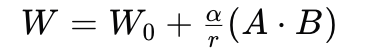
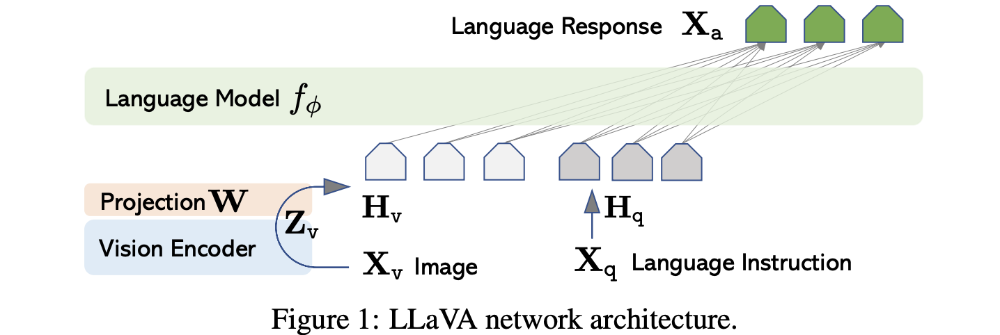
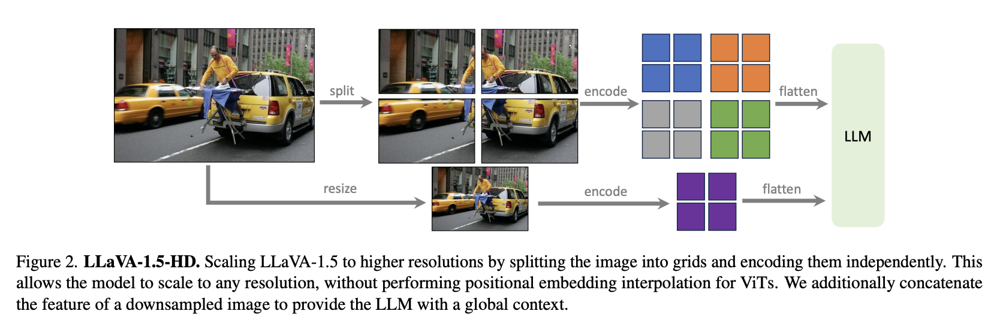
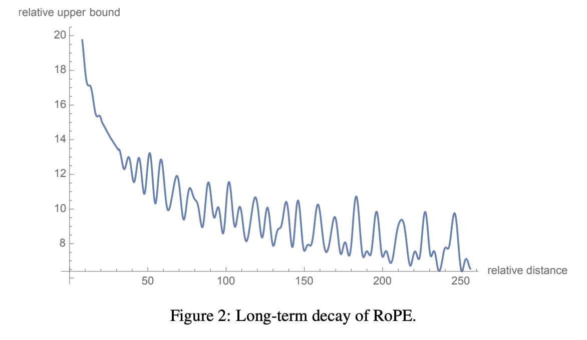

# 一. 介绍
* 一个用于学习基于transformer的nlp和vit模型的菜鸟仓库，介绍模型原理，训练步骤，微调方法等
* 分享能快速理解并上手的代码实战项目（或推荐、或开发）
* 适用于具备一定torch基础、想要快速入门transformer、想要能够阅读代码并二次开发的同学

## 目录
- [论文原理](#二-论文原理)
- [代码解读](#三-代码解读)
- [经典自然语言transformer](#四-经典自然语言transformer)
  - [GPT](##(一)GPT)
    - [实战: 完整训练一个GPT的问答模型]()
  - [Bert](##(二)Bert)
    - [实战: 中文地址分类]()
  - [T5](##(三)T5-encoder-decoder-集大成者-统一NLP任务)
    - [实战: 中文摘要总结]()
  - [DeepseekV3](##(四)DeepseekV3-decoder-only-推理训练低成本怪物)
    - [实战: V3技术分析]()
- [经典视觉transformer](#五-经典视觉transformer)
  - [Clip](##(一)Clip-对比学习弱监督)
    - [实战: 对比学习从头训练clip]()
  - [LLaVa](##(二)LLaVA-adapter高效多模态指令对齐)
    - [实战: llava入门transformer组件微调]()
  - [Dinov2](##(三)Dinov2-区分性自监督蒸馏)
    - [实战: 蒸馏训练一个dinov2]()
  - [Hiera](##(四)HieraMAE自监督预训练)
    - [实战: MAE自监督预训练一个Hiera]()
- [模型压缩](#六-模型压缩)
  - [蒸馏](##蒸馏)
  - [量化](##量化)
- [附录](#七-附录)
  - [RNN](##(一)RNN)
  - [模型组件](##(二)模型组件)
  - [模型降显存](##(三)模型降显存)

# 二. 论文原理
<div align="center">
  
  <p style="font-size: 10px; color: gray;">经典transformer</p>
</div>

首先推荐先阅读[周弈帆的博客解读transformer](https://zhouyifan.net/2022/11/12/20220925-Transformer/)， 达到能够理解以下重点，陈述思路为从局部到整体: 

* 注意力机制: `q*K^T`做一次向量化查询，`sofmax(q*K^T / sqrt(d_model)) * V`完成查询结果的加权, q*K^T权值大小量级与维度正相关, sqrt(d_model)用于缩放，类似于标准化，将softmax梯度集中在明显变化区域。每一次查询匹配一次key表，生成新的val特征，特征提取方向与loss下降方向一致。可以理解为基于query进行特征挖掘，特征信息来源可以是自身(self-attantion)或者其他对象(cross-attention)

* 多头注意力设计: 按照d_model折叠分组查询，参数量使用更少，最后通过一个ffn进行全局特征的交互，保证效果相当

* 注意力mask: 在sequence上，保证当token前查询只能看到自己以及之前的token信息，模拟rnn的串行输出，在decoder的自注意力层使用causal-mask作用于`q*K^T`注意力得分实现

* 可训参数矩阵`Wq Wk Wv Wo`实现类似自动化特征工程的效果，如对一个token x计算`q=x Wq^T`可以生成一个查询向量，查询优化方向和loss下降方向一致，torch中以nn.Linear线性层表示这些矩阵  

* FFN前馈神经网络, 隐藏层维度设置`4*d_model`，特征向量映射在更高维的隐空间交互，实现类似特征增强的效果, 4这个值目前看没太多意义，应该是基于最佳实验原则设计

* pos embedding沿着sequence_length和d_model对应的两个维度对token embedding加上位置数值，标记位置信息。简单理解一个特征矩阵Q中任意一个数值通过向前diff和向上diff可以提取位置信息，模型可以学到这种模式

* token embedding矩阵是可学习矩阵，实现将一个token_id转换为对应embedding向量，维度数量d_model。注意，与卷积 通道数值不同，每一个维度下的token向量值并不是指向某种性质，纵向对比没有意义

* 训练阶段，对比rnn, transformer能够做到训练的并行，即输出一次性包含了所有输入片段的next token，这一点归功于causal-mask的设计, 模拟了信息串行

* 预测阶段，与rnn相同，transformer自回归预测下一个token，当出现终止符则停止
  
**[论文](https://arxiv.org/abs/1706.03762)** 模型结构为encoder-decoder的结构，基于两个组件所衍生的自然语言经典模型见第四节

# 三. 代码解读
根据[周弈帆的博客-PyTorch Transformer 英中翻译超详细教程](https://zhouyifan.net/2023/06/11/20221106-transformer-pytorch/)手撕一遍transformer的代码，了解各个组件设计以及代码设计风格。该代码基本与transformer论文结构相同，唯一的区别在于最后的`ouput_head`是一个单独的线性层，与embeding层不共享权重。


# 四. 经典自然语言transformer
## (一)GPT
* 介绍: decoder-only结构，通过self-attention的casual mask保证每个token只能看到上文信息，输出自回归预测下一个token。适用于输出为下一个关联token的所有sep2sep任务，如：问答，机器翻译，摘要生成，音乐生成等
* 预训练: 采用自回归语言模型训练方式，训练目标为预测下一个token，即输入是一段文本，输出是下一个文字，基于casual mask实现并行训练
* 微调: 采用sft监督指令微调，对每一条input-output数据对处理为特殊问答模版，只对output对应的输出进行监督，使得模型能够理解输出的模版指向，具备指令遵循的能力
* 偏好对齐：采用RLHF的PPO或DPO对齐模型输出偏好，原来的技术报告使用的是PPO算法进行偏好微调 

### 实战: 完整训练一个GPT的问答模型
这一节重点介绍llm模型训练流程及相关的方法，推荐根据轻量化llm项目完整过一遍对话模型的开发[Minimind](https://github.com/jingyaogong/minimind)
> 只要求跑通进行代码阅读的情况下，4Gb显存的卡将batch_size设置为1可以吃得消
<div align="center">
  
  <p style="font-size: 10px; color: gray;">minimind项目decoder-only结构</p>
</div>

---

### 1.预训练
* 预训练 prtrained，的目的是让模型具备合理预测下一个token的能力，合理体现在能够根据一个字依次接龙成符合逻辑的一段话
* 预训练的输入是`input_ids[:-1]`，标签是`input_ids[1:]`，input_ids是指文字经过tokenize后的id列表，id是文字在词表中的index映射，如`我爱你 --转换--> <s>我爱你<\s> --id映射--> [1, 2, 23, 4, 2]`
  * 之所以输入与标签要错开一位，目的在于实现预测下一个token的监督学习。例如输入文字是‘我爱你啊’，那么预测下一个token逻辑是`我 --预测--> 爱; 我爱 --预测--> 你；我爱你 --预测--> 啊`，第i个标签有前面i-1个输入预测得到
  * 使用casual mask能对信息进行遮掩，确保每个位置只能看到上文信息，实现训练并行，即模型ouput中的每一个位置是由该位置之前的所有信息预测得到的, 初始的`ouput[0]`则由`<s>`预测得到
  * 这里的训练并行可以与RNN的训练串行进行对比。RNN训练需要依次次输入`(我, 爱)，(我爱, 你)，(我爱你, 啊)`，只是中间有一个隐态传递过程，而transformer只要一次性输入`(我爱你, 爱你啊)`。注意这里省略了起始和结束符号

* 预训练的损失函数为`corss entropy`, 模型输出的形状为`(batch_size, max_seq_length, voc_size)`, `max_seq_length`为对输入文本截长补短的最大长度，`voc_size`为词表的token总数
* 损失计算的逻辑为对输出沿最后的轴进行softmax得到logits，形状不变；沿着max_seq_length取出label对应的token_id，与logits计算损失
* 由于所有label的真实长度不一定为max_seq_length，对短的label需要补全一个padding占位，才能进行统一的batch训练，因此需要设置一个真实token_id的mask标记真实的需要进行损失计算的label元素，过滤占位的元素

---

### 2.监督微调
* 监督微调 SFT, 目的是让模型能够清除知道这是在问问题，需要进行回答。
* 监督微调的输入是将问答对嵌入问答模版，处理成标准格式。如将原始的问答对`q: 你是谁? a: 我是人工助手`，处理成
 `用户<s>说:你是谁？</s>\n助手<s>回答:我是人工智能助手</s>\n`，构成新的语料微调预训练模型，继续训练模型对这引导模版`用户<s>说:你是谁？</s>\n助手<s>回答:`的下一个字词接龙的能力
  * 对话模板通过引入特殊的字符，微调后能够让模型理解问题句柄，知道这是一个问题，从而触发接龙问题后面的答案，直到出现结束符合为止

* 监督微调与预训练的区别在于损失的计算以及训练的参数
  * 监督微调只计算输出中对应标签`回答: ***`的部分，其余部分不计入损失，但这些部分会在attention中被关注到
  * 训练参数取决于不同的微调方法，常见 全量微调, 低秩微调(lora), 低bit微调, 适配器对齐(adapter), preEmbed, prefix...等

*以下着重对lora微调进行详细介绍，其他微调方法只做简单说明* 

#### 01低秩矩阵自适应微调 lora
  [lora](https://arxiv.org/abs/2106.09685)微调是大模型最常用的微调手段，本质是对linear层进行调整，如可学习矩阵**W（Wq Wk Wv Wo ...）**，但不直接对其进行训练，而是使用类似残差连接并控制训练参数自由度的方式进行训练，基本公式为如下
  <div align="center">
    
  </div>
  * linear层参数是一个shape为(in_feature, out_feature)的参数矩阵(先不考虑bias)，表示为W0
  * A是shape为(in_feature, r)的矩阵，B是shape为(r, out_feature)的矩阵。设定r远小于out_feature，A和B为低秩矩阵，r越大，AB的参数的自由度越高
  * α是lora_alpha，用于缩放低秩矩阵的增量，平衡每一次参数更新对原参数W0的影响
  * "+"的方式类似残差连接的结构，保证原始模型效果不退化太大

  相比全量微调lora需要的显存大大减小，但在小模型上训练速度不一定更快
  > 小模型forward过程耗时占比增加，占大部分计算量

#### 02其他微调方法
* 全量微调: 使用预训练模型权重进行初始化，使用较小的学习率对模型的全部参数进行训练
* PreEmbed: 只微调token embedding参数矩阵，适应新的数据分布
* Prompt tuning: 在输入token前增加特殊的提示token，只微调提示token的embeding向量参数，适合小模型适配下游任务
* P tunning: 是Prompt tuning的进阶版，提示token可插入在prompt的指定位置，形成特殊模版
* Prefix: 进行虚拟上下文嵌入，在attention层的`K=X * Wk，V=X * Wv`对X增加可学习前缀token embeding矩阵，作为虚拟的提示上下文, `K=[P; X]Wk V=[P; X]Wv`P是可学习的参数矩阵，维度(L, d_model)，L表示需要增加的提示前缀长度，是超参数。`[P; X]`表示在X输入矩阵开始位置拼接矩阵P
  > prefix微调的是每一个transform层中的attention可学习前缀矩阵P，不同的层中，P不共享
* Biasfit，只微模型的偏置项，偏置项出现在所有线性层和Layernorma层中
* Adapter，在transform模块的多头注意力与输出层之后增加一个adpter层，只微调adpter参数。adapter包含`下投影linear + nolinear + 上投影linear; 残差连接结构`
  > 中间结构类似lora变体为`nonlinear(XA)B`的结构，残差连接结构保证的模型能力最多退化为原模型
  > 由于改变了Laynorm输入的数据分布，Laynorm的scale参数也需要加入训练

---

### 3.偏好对齐
  偏好对齐(优化) preference opimized, 目的是让模型的输出更加符合用户的习惯，包括文字逻辑、风格、伦理性、安全性、情感等。GPT技术啊报告使用了PPO的强化学习算法，常见的的强化学习算法还要DPO,GRPO等

##### 01PPO
  这一部分需要较强的理解能力和一定强化学习的基础，具体的解读和代码注释，参照我的另一个仓库[deepseek_learning: r1 ppo](https://github.com/Aorunfa/deepseek_learning)
  > PS 至今我也只是浅显地理解大概，止于浅层应用 

##### 02DPO
直接偏好优化 direct preference opimized，与PPO不同，直接跳过了奖励模型的训练，根据偏好数据一步到位训练得到对齐模型。[论文](https://arxiv.org/abs/2305.18290)解读可以参考博客[人人都能看懂的DPO数学原理](https://mp.weixin.qq.com/s/aG-5xTwSzvHXN4B73mfKMA)  

DPO从PPO总体优化目标的三个原则出发```每一步更新，模型输出尽可能接近偏好标签，尽可能偏离非偏好标签，尽可能少偏离原模型输出```，推导最优奖励模型的显式解，代入奖励模型的损失函数，得到一个只与待训模型有关的损失函数，该函数就是偏好优化的目标

筒体而言就是理论推到了一个损失函数，用这个损失函数和给定的偏好数据微调模型
> 手撕dpo训练代码可以参考本仓库的`/minimind/5-dpo_train_self.py`，前提要先自己捋一遍minimind

### 4.效果评估
... pending 不同的任务评价指标不同，需要系统梳理多任务类型才能进阶

----
  
## (二)Bert
* 介绍: encoder-only结构，只包含transformer的encoder。self-attendtion中每个tokend都可以看到上文和下信息，输出与句子整体语义和token序列相关，无法自回归预测下一个token。适用于输出为类别、数值的所有sep2sep，sep2val任务，如: 分类问题(情感分类，邮件分类, 多选问答，抽取问答...)，序列标注（词性标注 邮寄地址信息提取）, 语义相似度... 对于bert的解读可以参考[链接](https://github.com/datawhalechina/learn-nlp-with-transformers)

* 预训练: 采用mask language和相邻句子判断的方式进行预训练
  > * mask language训练方式随机遮掩token(10%被随机替换为其他token, 5%为统一替换为mask token)，对齐被遮掩的token输出预测和真值。通过这种挖词填空促使模型也能理解上下文信息
   
  > * 相邻句子判断，将输入划分为句子+分隔标记+下一句子，通过CLS位置的输出进行分类监督, 使模型能够理解上下句的关联。这个训练步骤在后续的研究中逐渐淡化，估计是没啥大用
  
  > * 特殊输入标记包括，类别标记`[CLS]`，句子分隔标记`[SEP]`，遮掩token标记`[MASK]`。`[CLS]`标记标记主要用于提取句子的整体语义，后续作为下游分类头的输入，也可用于语义相似度
  
  > * embedding由三类向量相加：`embeddings = words_embeddings + position_embeddings + token_type_embeddings`，token_type区分上句或下句，三者都是可学习参数，形状分别为`(voc_size, d_model), (max_seq_len, d_model), (2, d_model)`。相加的含义可以用one-hot编码就行解释，等同于`onehot[word-hot, pos-hot, type-hot] * [W_word, W_pos, W_type] ^ T`，本质是一个查询操作

  > * 位置编码由上面的position_embeddings完成，为可学习参数
  
  > * 对于输入截长补短产生的padding mask区分实际token和padding token，用于在softmax中归零padding token的注意力得分，例如一个token查到padding token，计算得到的注意力权重应该为总是0

* 微调: 以bert作为backbone增加输出头，初始化pretained权重，只训输出网络或较以较小学习率全量微调即可达到不错的效果

### 实战: 中文地址分类
项目见本仓库`/Bert-Chinese-Email-Addresses-Classification`，适用地址文本解析，快速理解整个bert模型结构，微调数据的加载方式和训练过程。参考于项目[bert中文分类](https://github.com/649453932/Bert-Chinese-Text-Classification-Pytorch)
  
## (三)T5
* 介绍: encoder-decoder结构，使用完整的transformer结构，统一的text-to-text框架，两个组件的特点决定了其适用于所有的NLP任务包括文本分类、机器翻译、摘要生成、问答等。[论文地址](https://arxiv.org/abs/1910.10683)[论文解读](https://zhuanlan.zhihu.com/p/89719631)
  
  一些结构差异说明:
  
  > * 共享的相对位置编码: 在attention层的计算注意力权重`qi * kj^T`上加上一个可学习的偏置项`bij`，在每个注意力层的同一个头共享一套bij参数，通过可学习的相对偏置表征相对位置 [详解](https://blog.csdn.net/qq_44665283/article/details/140526203)
  > * Teacher Forcing的训练策略: 训练gpt输入和输出的匹配策略。本身用于rnn自回归任务中，训练时使用t时刻的真值作为t+1时刻的输入，但需要计算t时刻预测与真值的损失。大白话就是将input[:-1]作为输入，input[1:]作为标签，t5的预训练使用这种，**而不是bert输出与输入的位置相对应**

* 预训练: 选择mask-and-mask-ratio、prefix的text2text方法
  > * prefix的text2text框架: 将所有的任务通过prefix进行表示，标签统一转换为prefix+文本到prefix+文本形式，见微调的例子
  > * 预训练方式: 采用bert风格掩码语言模型的训练方式，预测mask的部分。(实验对照: 自回归式、文本打乱还原式)
  > * 破坏方式：采用replace span，replace连续的token并打上唯一标记，target为`(唯一标记 + mask内容) * n + 终止符号`，可加速训练，n为replace个数。(实验对照：bert的mask方式，随机丢弃)
  > * 破坏比例：采用15%的破坏比例
  > * 遮掩span长度：采用3的span长度
  > * 多任务加微调策略：**无监督数据里面混入一定比例的多任务的有监督数据**，有监督数据的构造方式同微调中text2text输入输出格式。与加入多任务数据数据预训练差不多，但最后采用的原因是可以监督下游多任务的性能
  
* 微调：全量，逐步解冻，adapter
  > * text2text输入输出格式: 输入为`任务类型的prefix + input; 目标prefix + target`，如翻译任务将数据`{'en': 'That is good', 'ge': 'Das ist gut'}`转换为`{'input': 'translate English to German: That is good', 'target': 'Das ist gut'}`最终合并为prefix标注输入`translate English to German: That is good. target: Das ist gut`。对于其他任务的转换形式参考论文
  > * 还是全量微调更胜一筹，逐步解冻次之

### 实战: 中文摘要总结
项目见目录`/T5-pegasus-chinese`，训练loss和case大致符合预期，
  * 这里强调解码方法 greedy-decoding vs beam-search，两者都适用于自回归场景
  > * greedy-decoding，每次选择logits最大的token作为下一个输入
  > * beam-search，设定beam size为k, 第一次回归选择top k的输出token作为k个波束序列, 下一次依次对k个波束进行自回归，得到k*k个波束，按照token的累乘或平均logit保留top k的波束序列，依次往后执行k个波束的自回归和排序过滤操作。保证模型每次回归只执行k次推理。用于翻译和摘要输出可以提高回答质量

## (四)DeepseekV3 
decoder-only的MOE架构，推理训练低成本怪物
* 具体的技术点解读和代码注释，参照我的另一个仓库[deepseek_learning](https://github.com/Aorunfa/deepseek_learning)

---

# 五. 经典视觉transformer
这一章介绍tranformer在视觉领域的经典应用，并开发分享能够快速上手新的视觉项目，理解模型结构和相关操作

## (一)Clip 对比学习弱监督
[clip](https://github.com/openai/CLIP)作为多模态的早期经典之作，主要通过对齐文本编码和图片编码，让模型能够匹配图片和给定文本，或匹配文本和给定的图片。主要适用视觉表征、文本到图片或图片到文本的匹配场景。特别地，clip预训练使用的大多是图片类别文本，我理解更适用以物体文本搜图
<div align="center">
  
  <p style="font-size: 10px; color: gray;">clip思路</p>
</div>

* 预训练
  > * 文本编码器使用类似带casual-mask的transformer结构，对文本最后添加一个结束符`=`，使用因果mask的注意力机制，经过transform后取结束符对应的编码表征文本信息
  > * 图片编码器使用经典vit，通过卷积划分不重叠的patch，展平，在开头添加一个cls token对应的可学习embedding向量, 输入attention encoder层，提取cls对应的嵌入向量表征图片信息
  > * 损失计算，对batch内的图片向量组和文本向量组，进行两两组合计算相似度，最大化batch中对应的图片-文本的相似度

* 举例: clip实现vit，以224×224图片、32×32的patch size为例:
  > * 以32×32kernal大小，32stride，输入channel为3，输出channel为d_model的卷积核完成patch划分和特征提取，得到形状为(7,7,d_model)特征图，展平为(49, d_model)的token_embeding矩阵
  > * 在的token_embeding矩阵的首行嵌入一行CLS向量，用于表征整个图片的特征，向量参数为可学习参数，token_embeding最后形状为(50, d_model)
  > * 位置编码的position embeding采用可学习参数
  > * 经过encoder后提取CLS向量对应的特征向量，通过一个前馈网络将特征维度对齐的到文字的特征维度`nn.Linear(oupt_dim, d_model)`表示图片的语义特征

* 一些后相关续泛化工作
  > * [Blip](https://github.com/salesforce/BLIP)，增加图片caption、qa能力
  > * [LLaVA](https://github.com/haotian-liu/LLaVA)，clip vision enoder + adaper +llm，高效对齐多模态指令遵循
  > * [DALL-E](https://github.com/openai/DALL-E)，增加基于VAE的文本到图片的生成
  > * ...

#### 实战
实战[clip_finetune](https://github.com/Aorunfa/clip_finetune)，CLIP的代码比较好读懂，从CLIP的代码可以快速搞懂Vit的具体的实现过程  
clip官方repo没有开源训练代码，不太好理解算法实现的具体细节，为此我结合[open_clip](https://github.com/mlfoundations/open_clip)，增加了clip训练代码，只需要少量数据和资源进行快速复现，方便快速理解算法设计细节

---

## (二)LLaVA adapter高效多模态指令对齐
[llava](https://github.com/haotian-liu/LLaVA)更新了三个版本v1、v1.5、v1.6。整体结构为使用vit作为vison encoder，权重初始化自clip，使用预训练的llama作为text decoder，中间设置一个adapter，将vison token对齐到text token的向量空间。   

在vison token featuer 前后增加特殊的图片开始和结束标志位，和text token完成特征拼接，模板化输入  

*llava的优势在于，使用的训练数据极少，完整的训练时间非常短，8×A100一天完成训练*

<div align="center">
  
  <p style="font-size: 10px; color: gray;">llava 结构</p>
</div>

> **llava-v1**
> * adapter设置为一个简单的投影矩阵（单linear层）完成对齐，输入图像分辨率为224。

> **llava-1.5**
> * adaptr设置为一个两层的MLP完成对齐，vison encoder使用更大的clip vit模型，输入图像分辨率为336
> * 同时prompt中设定短答案输出的格式，增加固定尾缀，提高短输出benchmark的准确度

<div align="center">
  
  <p style="font-size: 10px; color: gray;">llava-1.6 patch process</p>
</div>

> **llava-1.6**
> * 从源码看来，是对论文中llava-1.5-HD的实现。使用224分辨力的clip作为vision encoder
> * 对高分辨率的图片resize并padding到预设高分辨率，将图片等分为四个区域加上一张原始resize图片(224的分辨率)，分别进行encoder后完成拼接，得到vison token

### 训练
训练包括两个阶段，全程冻结vison encoder，第一阶段只训练adapter，完成模态对齐。第二阶段训练adaper和llm，完成指令微调，可见其高效性

### 实战: llava快速入门transformer微调组件
实战[lava_fitune](https://github.com/Aorunfa/llava_finetune)，我从llava将下述方法单独列出，进行了微小的改动，特别针对fsdp和ddp写了一版训练代码，方便快速理解训练实现细节
- lora微调
- qlora微调
- 4bit、8bit量化训练
- fsdp分布式数据并行训练
- deepseed的zero范式和accelerate加速

---

## (三)Dinov2 区分性自监督蒸馏
[dinov2](https://github.com/facebookresearch/dinov2)是视觉自监督训练的经典之作。总体思路是训练过程不断对齐局部的特征信息和整体的特征信息，使模型能够捕捉图片的物体空间分布信息；可以理解为不断让模型看到局部的特征去推测全局的特征，告诉他推测好坏不断提升这种能力

dinov2通过只是蒸馏的方式实现这个过程: 整体特征由教师模型提取，局部特征由学生模型提取。教师模型与学生模型是同一结构，只是权重由学生模型通过ema跟新。这种方式可以提取高效的视觉表征，适应下游分类、分割等任务和以图搜图等。

对比clip是一种自监督方法，预训练不依赖任何标签信息

<div align="center">
  
  <p style="font-size: 10px; color: gray;">dino思路</p>
</div>

#### vit结构
* patch embedding提取: 卷积实现
* pos embedding: 使用可学习参数相加，两类参数分别作用于cls token的和patch token的，插值实现patch的延展
* transformer block: 使用残差连接的drop path方法
* head: MLP层, 按照信息区分为image-level和patch-level的head；分别用于计算dino和ibot的损失，解耦输出头

#### 蒸馏学习
* 教师模型与学生模型使用同一个模型结构。不同在于，教师模型输入2张global crop，学生模型输入8张local crop。这里的global和local可以理解为更大和更小的裁剪图片
* 将教师模型与学生模型的输出特征升到高维度后进行对齐，促使学生模型能够通过局部了解整体的能力
* 教师模型的参数通过ema加权学生模型的参数与历史参数，提高训练稳定性

### 损失设计
* do_dino: 图片语义层级的损失(image level)，教师与学生模型的cls输出经可能相似，教师global输出对齐对应的学生global、学生所有的local输出
* do_ibot: patch level, 对于gloable，学生模型随机mask一些patch，教师模型正常输入。对mask的学生模型patch使用可学习的参数替换embeding，mask patch的最后输出与教师模型的gt尽可能相似
* do_koleo, 促使批次在特征空间内更加均匀分布，只监督学生模型vit的cls输出。蒸馏需要将输出升到超高维，如果存维度的数值集中在某些维度区域，很有可能造成模型参数更新的“偏心”，侧重对齐某些部分参数而失去的整体性的考量

* SwAV：样本中心化方法， Sinkhorn-Knopp归一化。对教师模型的输出进行batch的去中心化


### 实战
...pending
02 手撕一版友好阅读的训练代码, dino简单预训练代码
    dinov2 原始的仓库项目深度使用的fsdp训练的组件，实现模型分片、进程同步、分片模型保存的
    
01 使用dino进行图片的retrival，以图搜图 -- 手撕一个retrival代码

### 一些后续泛化工作
  * [grounding-dinov](https://github.com/IDEA-Research/GroundingDINO)

---


## (四)Hiera MAE自监督预训练
> 引子：之所以把hiera加进来，是由于其用到了MAE的高效自监督训练方法理解图片结构信息，同时sam2也以hiera作为高效特征提取器
* [hiera](https://github.com/facebookresearch/hiera)第一个特点是优化了传统vit结构在特征分辨率始终如一的特性，使用了池化的方式减小深层的特征的分辨率，提高了参数利用率(可以类比于经典高效卷积结构大多是多层级的分辨率特征图进行组合)
* 第二是采用了[mask-auto-encoder](https://github.com/facebookresearch/mae)的自监督方法进行预训练  
hiera更轻量，微调下游任务效果更好，官方主要针对imgnet1k分类和k-400视频动作的分类进行了微调。论文解读可以参照[Hiera笔记](https://zhuanlan.zhihu.com/p/719060883)

<div align="center">
  
  <p style="font-size: 10px; color: gray;">hiera思路(搬运自Hiera)</p>
</div>

### 特征提取器
  * 浅层layer使用高分辨率和小特征维度，深层特征使用低分辨率和大特征维度
  * 使用maxpool进行特征图下采样
  * 前两阶段使用局部窗口注意力机制（mask unit window），后两个阶段使用全局注意力机制
  
### MAE训练方式
该方法主要是随机遮掩图片的patch窗口，将未遮掩的patch窗口拼接，送入encoder进行编码，再由decoder预测出被mask掉的patch窗口，mask的patch窗口的真值和预测值最后会由一个nn.Linear层将特征维度映射到超高维度，使用MSE损失度量分布差异

* mask生成: 计算遮掩给定大小连续patch的方阵(mask_unit)后得到的特征图分辨率，基于该分辨率随机mask给定比例的点，保证batch内的每一个图mask的比例相同，才能进行min-batch training

* 损失计算
  > * encoder得到没有被mask掉的patch特征
  > * 恢复到原来的patch排列顺序，mask区域填充*可学习参数*，非mask区域填充encoder得到的特征
  > * 送入vit decoder得到最后预测输出
  > * 获得标签，对原图片按照最终的下采样stride分块，块状内的channel展平，对齐预测输出的特征空间维度，筛选出被mask掉的区域
  > * 通过线性层间预测值与真值的特征维度映射到超高维度(65535), 使用均方误差计算pred和label的差异

### 实战: MAE自监督预训练一个Hiera和视频分类微调
Hiera的代码在maxpool的操作上极难读懂，但实战只需要知道函数功能即可
Hiera官方repo没有开源训练代码，为此写了一版mae和微调的训练代码，可以参照[hiera_finetune](https://github.com/Aorunfa/hiera_finetune)，同样只需要少量数据和资源进行快速复现

---

# 六. 模型压缩

## 蒸馏
适用将大模型的知识转移到小模型   
需要有一个教师模型和学生模型，教师模型能力优于学生模型。训练阶段，对教师模型的输出的logits进行升维度，e.g 65535，获得教师模型输出的充分分布。学生模型的输出logits同样进行升维，对齐学生模型与教师模型输出。升维矩阵可以是随机初始化的。   

对齐损失可以使用corss-entropy，KLloss；同时对logits的分布形态也可以做一些监督，避免偏态等。

实战[dinov2_finetune](https://github.com/Aorunfa/dinov2_finetune)

## 量化
适用大模型训练、推理降低显存，牺牲时间换空间    
低bit量化原理是对模型参数和激活值进行量化，量化参数使用更低精度的数值类型，e.g fp32-->fp8 存储32bit-->8bit，增加反量化恢复的计算开销，但约成倍降低显存。

  量化的简单原理，e.g fp16量化为fp8，发生在权重量化和激活值量化
  * 给定的高精度矩阵W，shape=(1024, 1024)，设定一个block_size=128×128
  * 对矩阵W按照block_size进行分块，可得到chuncks_num = 1024 / 128 * 1024 / 128 = 64个chunck
  * 对每一个chunck，计算缩放系数`s = max(abs(chunck)) / 448.`, 448为fp8最大表示范围，s使用fp32存储
  * 对每一个chunck进行量化 `chunck_quant = chunck / s`，报错量化参数`chunck_quant.scale = s`
  * 对激活值的量化一般去一维的block_size=128，对每个token feature单独进行

  量化的另一种方式是使用chunck内的数值分布，对应高斯分布，量化参数取分位数，缩放参数为对应的高斯分布分位数对应的数值

  反量化的简单原理，e.g fp8反量化为fp16：W_dequant = W * W.scale，存储为fp16精度

实战[lava_fitune](https://github.com/Aorunfa/llava_finetune)，如何使用peft进行量化训练
实战[DeepseekV3](https://github.com/Aorunfa/deepseek_learning)，量化与反量化核函数的操作

## 剪枝
...pending

---

# 七. 附录
这一部分主要增加一些延展知识

## (一)RNN
在transformer出现后，在nlp的各任务中rnn逐渐被替代，但在一些结构化数据的时序预测仍广泛使用。   
原理解读参照[吴恩达《深度学习专项》笔记（十四）：循环神经网络基础](https://zhouyifan.net/2022/09/21/DLS-note-14/)   
代码实战参照[你的第一个PyTorch RNN模型——字母级语言模型](https://zhouyifan.net/2022/09/21/DLS-note-14-2/)     
* RNN基本原理可以概括为，通过维护一个中间状态`a(t)`，捕捉数据时序依赖关系。t时刻中间状态`a(t)`由t-1刻状态和t时刻的输入通过可学习参数矩阵W进行转换`a(t) = W([a(t-1), x(t)])`，`[a(t-1), x(t)]`表示横向拼接。t时刻输出由解码器对隐状态`a(t)`进行解码`y(t) = decoder(a(t))`。  
* RNN为了解决长时序依赖尾部数据难以获得首部数据信息问题， RNN变体模拟时序记忆的存储与衰减机制，代表性的有**GRU、LSTM**。
  > * GRU本质上考虑a(t)更新的偏好`a(t) = Wu * a(t) + (1 - Wu) a(t-1)`，增强中间隐状态对先前信息的留存空间。权重因子`Wu = sigmoid(W[a(t-1), x(t)]), W是可学习参数矩阵`
  > * LSTM需要维护两个中间隐状态，更新的机制也更加复杂，但整体思想与GRU相似。总之，GRU计算更高效，LSTM拟合能力更强。
* 基础RNN的结构只考虑单向的信息，t时刻的只能看到t时刻之前的信息编码，BRNN增加一个逆向传递结构（输入从后往前），实现t时刻双向信息编码。该抽象结构可以以基础RNN，GRU、LSTM为基模型进行搭建。不足之处在于对于需要完全输入信息后才能产生预测，不适用于实时输出的场景, 如实时翻译。
* 深层RNN可以叠加n个基rnn单元，自下往上，当前层的输出作为上一层的输入，需要维护n个隐状态。同时，可以增加更加复杂的输入编码和输出解码的结构，实现更复杂的特征工程和信息过滤，**适用于结构化时序数据的自动特征工程。**

---

## (二)模型组件
### 1. 常见归一化方式: BatchNorm vs LayerNorm vs RMSNorm
> 首先明确归一化的作用。数据经过每一层的变化和激活后，数据分布会不断向激活函数的上下限集中，此时激活函数所带来的梯度变化随着层变深而变小，最终出现梯度消失
> 另一方面，机器学习建模的前提是训练与测试集独立同分布，当出现不同分布的数据时，在forward时分布差异变大，不利于网络的稳定训练。基于此，人为将数据拉倒相同分布有利于增强模型鲁棒性。同时将分布主体scale到0-1，集中在激活函数的明显变化区域，有利于解决深层网络梯度消失问题

* batchnorm沿着特征维度对batch一视同仁进行归一化，例如卷积网络按照channel的每一个维度对batch样本进行归一化
* layernorm沿着batch维度对特征一视同仁进行归一化，例如tranformer block按照batch样本对其所有维度特征进行归一化
> - 两者有两个可学习参数，rescale参数和偏置参数
* rmsnorm是layernorm的改良版，去掉了去中心化的计算过程，提高了计算效率，只有一个可学习参数即rescale参数。

* batchnorm适用于卷积结构，训练时batchsize大，均值与方差具备代表性；layernorm适transform、rnn结构，训练时batchsize小但是feature维度高。另一个比较好的解释是，图像数据是客观存在的表示，对每个样本的channel特征进行归一化具有实际意义。而自然语言的表示是人为构造的(token embeding, 对话模版等)，通过embeding转换为数字表示，客观上并不存在，对每个样本特征维度进行归一化缺少实际意义。
  
### 2. 常见位置编码: 三角位置编码 vs 旋转位置编码 vs 可训练的位置编码

* 三角位置编码 Sinusoidal PE, 对正余弦函数进行取值进行绝对位置编码，而旋转位置编码 Rope，则依次对上下两个token embedding进行旋转变换，同一个维度下前后两者间具有相对的旋转位置关系，实现相对位置编码。两者都具有可延展性，rope在捕捉长序列的相对关系上更具有优势。这里的可延展性是指可以使模型能够处理超出训练长度的序列
  
* 可学习的位置编码 Learnable PE，预设可学习的参数矩阵，在训练中进行更新。好处是位置表征能力更强，但延展性差，无法处理出现超越编码长度的输入，bert模型使用该编码方式。

### 3.ROPE详解
目前流行的llm通常在attention和embedding层使用这种相对位置编码，使当前位置的token更加关注临近位置token，在长时序捕捉能力更强。[论文](https://arxiv.org/pdf/2104.09864) [论文解析](https://zhuanlan.zhihu.com/p/647109286)
<div align="center">
  
  <p style="font-size: 10px; color: gray;">rope原理</p>
</div>

#### *原理介绍*  
* 相对位置编码通过在注意力计算`q[m]*k[n]^T`引入q和k的相对位置信息(m-n)，从而标记位置信息。这里q,k都是行向量     
* 先从二维向量的考量，`q[m]和k[n]`可以通过引入与位置参数相关的旋转矩阵函数`R(posion)`，若R满足`q[m]*R(m) * (R(n)*k)^T) =q[m]*R(m-n)*k^T`，此时对attention计算结果成功引入了相对位置信息。   
* 推广到多维向量，只需要对q，k的向量元素两两配对，R的控制参数在位置基础上引入维度索引，由于attention点乘后具有加性，刚好也能够性质`q[m]*R(m) * (R(n)*k)^T) =q[m]*R(m-n)*k^T`，作者设计这种R函数机制，如图rope原理

#### *远程衰减性的证明：随着相对距离变大，qk^T的权重应该是下降*  
原始论文通不等式转换，在进行旋转位置编码后计算q*k^T的注意力分数是一个与相对距离有关的分数，其最大值存在远程衰减性。这一性质使得注意力计算中更加关注邻近token
<div align="center">
  
  <p style="font-size: 10px; color: gray;">注意力上限衰减曲线</p>
</div>

#### *外推延展性的证明：超出序列长度，仍能不做超预训练相对长度的位置关系*   
* 论文中没有提到这种外推的说明，说一下自己的直观理解。远程衰减性可以看出，ROPE使得token更加关注近邻位置，关注度与q,k的相对距离有关，而与绝对的位置无关。   
* 我理解注意力计算的q*k^T只要相对关系不超出预训练的最大相对长度，都是能够在训练效果内的，那么对于每个token，应该有一个前后有效的最大窗口。而对相对距离超出的窗口的，这些q,k注意依赖本身也很弱，因此影响不会太大，加上前后信息的传递性，这种影响会被进一步削弱。   
* 因此，当新增序列，仍然能够被有效处理。

#### *代码解析*   
* 矩阵点乘实现：论文中为了避免稀疏矩阵做内积的低效性，提出了点乘实现寻转位置编码，可以参照```/Rope/rope_chatGLM.py```   
* 虚数内积实现：另一种优化方式是，使用虚数矩阵做内积实现，可以参照```/Rope/rope_llama.py```


### 4.各类多头注意力机制
ongoing...
MHA MLA MQA MGA...

### 5.线性注意力
ongoing...

---

## (三)大模型微调降显存
### 1. 低端bit量化训练
  低bit微调原理是对模型参数和激活值进行量化，量化参数使用更低精度的数值类型，e.g fp32-->fp8 存储32bit-->8bit，增加反量化恢复的计算开销，但约成倍降低显存。注意激活值需要存储用于反向传播的梯度计算。

  量化的简单原理，e.g fp16量化为fp8，发生在权重量化和激活值量化
  * 给定的高精度矩阵W，shape=(1024, 1024)，设定一个block_size=128×128
  * 对矩阵W按照block_size进行分块，可得到chuncks_num = 1024 / 128 * 1024 / 128 = 64个chunck
  * 对每一个chunck，计算缩放系数`s = max(abs(chunck)) / 448.`, 448为fp8最大表示范围，s使用fp32存储
  * 对每一个chunck进行量化 `chunck_quant = chunck / s`，报错量化参数`chunck_quant.scale = s`
  * 对激活值的量化一般去一维的block_size=128，对每个token feature单独进行

  量化的另一种方式是使用chunck内的数值分布，对应高斯分布，量化参数取分位数，缩放参数为对应的高斯分布分位数对应的数值

  反量化的简单原理，e.g fp8反量化为fp16：W_dequant = W * W.scale，存储为fp16精度

  *使用triton编写量化内核的实战，可以参照我对deepseekV3推理代码的解读[deepseek_learning](https://github.com/Aorunfa/deepseek_learning)*

### 2. 双重量化lora微调 q-lora
  [Qlora](https://arxiv.org/pdf/2305.14314)本质上是一个nf4的模型双重量化，权重微调方法使用lora   
  第一次使用fp8对模型权重进量化，得到量化后的权重和分位数缩放系数矩阵   
  第二次使用nf4对量化后的权重进行第二次量化增加了attention分页优化策略。牺牲计算的效率换显存。

### 3. FSDP
  FSDP是DDP的显存优化版本，将指定层的参数进行分片，共享给多个GPU，降低显存，但计算时需要聚合所有分片，增加通信开销   

### 4. 其他分布式训练方法
  * pipeline parallelism拆分层分配到不同的GPU。需要细致地划分组合，通信开销较小，重叠计算效果较差
  * tensor parallelism将每一层分片，分配到不同的GPU。容易等分，通信开销最大，重叠计算效果好

### 5. 梯度检查点
  梯度检查点技术 gradient checkpointing, 用于减少训练过程中激活值的存储，从而降低显存
  * 原本在神经网络进行forward的过程中，所有的激活值(激活函数的输出)需要被保留，在backward计算梯度时使用
  * 梯度检查点技术则选择性的保留一些激活输出，同时丢弃一些激活输出。在backward过程中，当需要的激活值被丢弃时，往上从最近被保留的激活值开始，往下重新计算直至得到被丢弃的激活值
  * 计算速度取决于保留检查点的分布，显存使用则取决于保存的检查点数量，数量越多分布越分散，计算速度越快，但显存依赖越多
  * peft库的模型封装可以通过use_gradient_checkpointing选择使用梯度检查点技术
